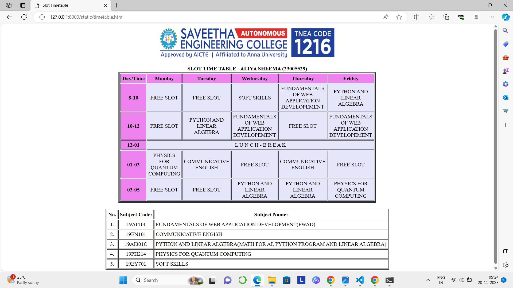

# Ex-05-Timetable

NAME : ALIYA SHEEMA

REFERENCE NUMBER : 23005529

DEPARTMENT : AIDS
# AIM
To Write a html webpage page to display your timetable.

# ALGORITHM :
### STEP 1
create a simple table using table tag
### STEP 2
Add header row using th tag
### STEP 3
Add your timetable
### STEP 4
Execute the program

# CODE :  
```
<html>
<head>
<title>Slot Timetable</title>
</head>
<body>
<center>

</center>
<br>
<table align="center" width="540" cellspacing="2" cellpadding="4" border="5" bgcolor="lavender">
<caption><b>SLOT TIME TABLE - ALIYA SHEEMA (23005529)</b></caption>
<tr align="center">
<th bgcolor="violet">Day/Time</th>
<th bgcolor="violet">Monday
<th bgcolor="violet">Tuesday
<th bgcolor="violet">Wednesday
<th bgcolor="violet">Thursday
<th bgcolor="violet">Friday
</tr>
<tr align="center">
<th bgcolor="violet">8-10</th>
<td >FREE SLOT</td>
<td >FREE SLOT</td>
<td >SOFT SKILLS</td>
<td >FUNDAMENTALS OF WEB APPLICATION DEVELOPEMENT</td>
<td >PYTHON AND LINEAR ALGEBRA</td>
</tr>
<tr align="center">
<th bgcolor="violet">10-12</th>
<td >FRRE SLOT</td>
<td >PYTHON AND LINEAR ALGEBRA</td>
<td >FUNDAMENTALS OF WEB APPLICATION DEVELOPEMENT</td>
<td >FREE SLOT</td>
<td >FUNDAMENTALS OF WEB APPLICATION DEVELOPEMENT</td>
</tr>
<tr>
<th bgcolor="violet">12-01</th>
<td colspan="5" align="center"> L U N C H - B R E A K</td>
</tr>
<tr>
<tr align="center">
<th bgcolor="violet">01-03</th>
<td >PHYSICS FOR QUANTUM COMPUTING</td>
<td >COMMUNICATIVE ENGLISH</td>
<td >FREE SLOT</td>
<td >COMMUNICATIVE ENGLISH</td>
<td >FREE SLOT</td>
</tr>
<tr align="center">
<th bgcolor="violet">03-05</th>
<td >FREE SLOT</td>
<td >FREE SLOT</td>
<td >PYTHON AND LINEAR ALGEBRA</td>
<td >PYTHON AND LINEAR ALGEBRA</td>
<td >PHYSICS FOR QUANTUM COMPUTING</td>
</tr>
</table>
<br>
<table align="center" cellspacing="2" cellpadding="4" border="2">
<tr align="center">
<th>No.</th>
<th>Subject Code:</th>
<th>Subject Name:</th>
</tr>
<tr>
<td align="center">1.</td>
<td align="center">19AI414</td>
<td>FUNDAMENTALS OF WEB APPLICATION DEVELOPMENT(FWAD)</td>
</tr>
<tr>
<td align="center">2.</td>
<td align="center">19EN101</td>
<td>COMMUNICATIVE ENGISH</td>
</tr>
<tr>
<td align="center">3.</td>
<td align="center">19AI301C</td>
<td>PYTHON AND LINEAR ALGEBRA(MATH FOR AI, PYTHON PROGRAM AND LINEAR ALGEBRA)</td>
</tr>
<tr>
<td align="center">4.</td>
<td align="center">19PH214</td>
<td>PHYSICS FOR QUANTUM COMPUTING</td>
</tr>
<tr>
<td align="center">5.</td>
<td align="center">19EY701</td>
<td>SOFT SKILLS</td>
</tr>
</table>
</body>
</html>

```
# OUPUT :




# RESULT :
The expected output has been successfully executed.
